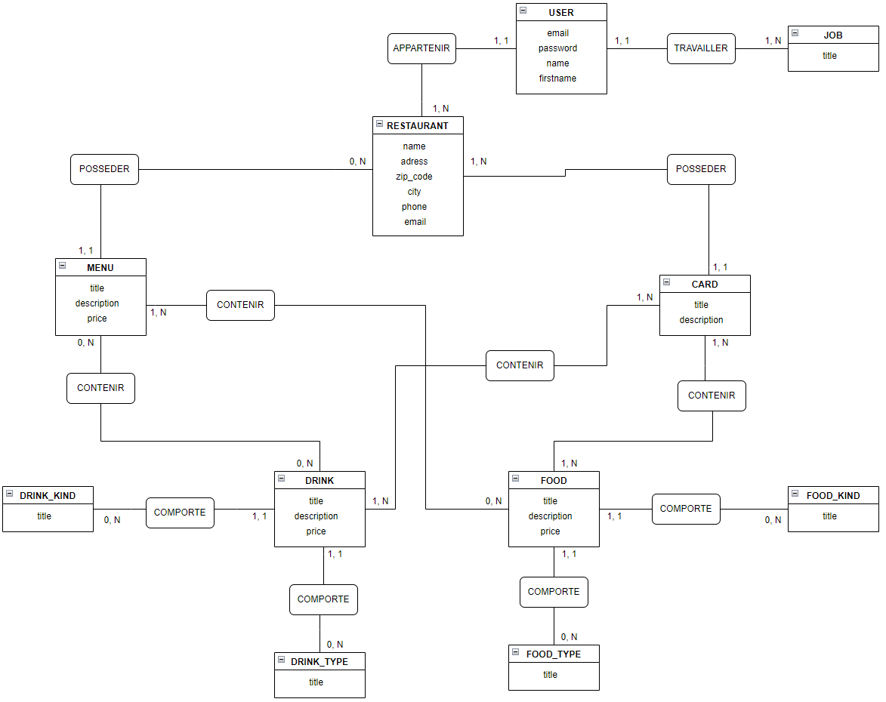

# Staff Back

  

  
## Table of contents

* What is Staff Back ?
* Stack

### What is Staff Front ?

Staff Back is a Case Study project for restaurant staff.  

It contains database and fake datas.  

It's deployed on Heroku and use Postgres and Sequelize ORM.

Other conception document are available in documents folder.

Enjoy your Staff Back.

### Stack

